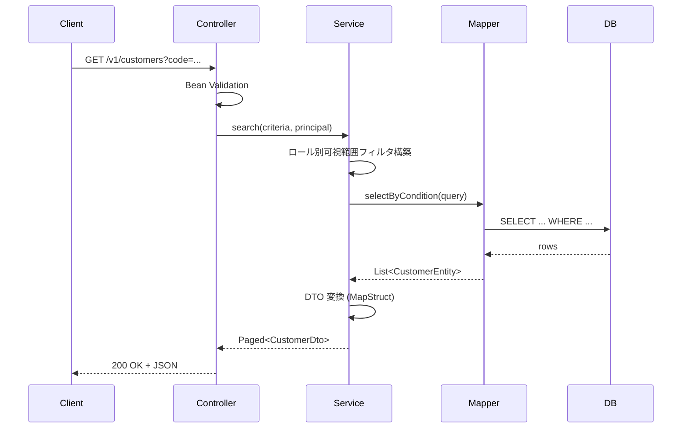

# API 内部処理設計書 — [エンドポイント]

> ひな型: vue-biz-app-design-spec/docs/templates/template-api-internal.md
> 1 エンドポイント = 1 ファイル を推奨。エンドポイント数が多い場合は機能領域ごとにまとめてもよい。

## 0. 文書情報

| 項目     | 内容                       |
| -------- | -------------------------- |
| 文書 ID   | API-INT-[YYYY-NNN]        |
| バージョン | 0.1.0                      |
| 作成日    | YYYY-MM-DD                 |
| 作成者    | [氏名]                     |

---

## 1. エンドポイント情報

| 項目         | 内容                                              |
| ------------ | ------------------------------------------------- |
| メソッド      | GET / POST / PUT / PATCH / DELETE                |
| パス          | /v1/customers                                    |
| API バージョン | v1                                                |
| 認証          | 要 (Bearer JWT, ROLE-001 以上)                    |
| Idempotency  | はい / いいえ                                     |
| 関連機能     | F-001 (顧客一覧)                                  |

---

## 2. 概要と業務処理

[このエンドポイントが何の業務処理を行うかを 3-5 行で]

業務処理フロー:

1. リクエストパラメータを Bean Validation で検証
2. 認証トークンから userId / role を取得
3. ロールに応じた可視範囲フィルタを構築
4. データアクセス層（MyBatis Mapper）で検索
5. 結果を DTO に詰めて返却

---

## 3. リクエスト

### 3.1 パスパラメータ

| 名前  | 型      | 必須 | 説明               | 制約         |
| ----- | ------- | ---- | ------------------ | ------------ |
| (なし) |         |      |                    |              |

### 3.2 クエリパラメータ

| 名前         | 型      | 必須 | 既定値 | 説明               | バリデーション                       |
| ------------ | ------- | ---- | ------ | ------------------ | ------------------------------------ |
| code         | string  | -    | -      | 顧客コード（前方一致） | 半角英数 / 1-20 桁                    |
| name         | string  | -    | -      | 顧客名（部分一致）  | 1-100 文字                           |
| status       | enum    | -    | all    | 状態フィルタ        | active / inactive / all              |
| page         | int     | -    | 1      | ページ番号          | ≥ 1                                  |
| perPage      | int     | -    | 50     | 1 ページ件数        | 1-100                                |

### 3.3 リクエストボディ

該当なし（GET なら不要）。POST/PUT の場合:

```typescript
interface CreateCustomerRequest {
  code: string;        // 半角英数 1-20
  name: string;        // 1-100 文字
  status: 'active' | 'inactive';
}
```

### 3.4 ヘッダー

| 名前            | 必須 | 値                         |
| --------------- | ---- | -------------------------- |
| Authorization   | 必須 | `Bearer <JWT>`             |
| X-Request-Id    | 任意 | リクエスト追跡用 UUID     |

---

## 4. レスポンス

### 4.1 成功時 (200 OK)

```typescript
interface CustomerListResponse {
  items: Customer[];
  total: number;
  page: number;
  perPage: number;
}

interface Customer {
  id: string;
  code: string;
  name: string;
  status: 'active' | 'inactive';
  updatedAt: string;   // ISO 8601
}
```

### 4.2 エラー時 (RFC 7807 — DD-010)

| HTTP   | errorCode             | type                                          | title             | 発生条件                       |
| ------ | --------------------- | --------------------------------------------- | ----------------- | ------------------------------ |
| 400    | E-CUSTOMER-001        | https://example.com/errors/validation         | Validation Error  | クエリパラメータ違反            |
| 401    | E-AUTH-001            | https://example.com/errors/auth/missing-token | Missing Token     | Authorization ヘッダーなし     |
| 401    | E-AUTH-002            | https://example.com/errors/auth/expired-token | Expired Token     | JWT 期限切れ                    |
| 403    | E-AUTH-003            | https://example.com/errors/auth/forbidden     | Forbidden         | ロール不足                      |
| 500    | E-SYS-500             | https://example.com/errors/system             | Server Error      | 想定外例外                      |

レスポンス例 (400):

```json
{
  "type": "https://example.com/errors/validation",
  "title": "Validation Error",
  "status": 400,
  "detail": "perPage は 1〜100 の範囲で指定してください",
  "instance": "/v1/customers?perPage=999",
  "errorCode": "E-CUSTOMER-001",
  "errors": [{ "field": "perPage", "message": "1-100" }]
}
```

---

## 5. 処理フロー



---

## 6. 認証・認可

| 項目              | 内容                                              |
| ----------------- | ------------------------------------------------- |
| 認証方式          | Bearer JWT (DD-011)                               |
| 必要ロール        | ROLE-001 (担当者) または ROLE-002 (管理者)         |
| 認可ルール        | 自身の部署の顧客のみ閲覧可。ROLE-002 は全件可。   |
| Spring Security 設定 | `@PreAuthorize("hasAnyRole('ROLE-001', 'ROLE-002')")` |

---

## 7. データアクセス (Backend のみ)

| Mapper                  | メソッド             | SQL ID                       | 備考                          |
| ----------------------- | -------------------- | ---------------------------- | ----------------------------- |
| CustomerMapper          | selectByCondition    | `customer.selectByCondition` | 条件部は `<if>` で動的構築    |
| CustomerMapper          | countByCondition     | `customer.countByCondition`  | total 件数取得                 |

SQL マッピング XML の格納場所: `src/main/resources/mapper/CustomerMapper.xml`

---

## 8. トランザクション境界

| 範囲     | 内容                                  |
| -------- | ------------------------------------- |
| Service層 | `@Transactional(readOnly = true)`      |
| 例外時   | 自動 ROLLBACK                          |

---

## 9. 例外マッピング

| 内部例外                          | 外部レスポンス                         | ハンドラ                                |
| --------------------------------- | -------------------------------------- | --------------------------------------- |
| `MethodArgumentNotValidException` | 400 + RFC 7807 + E-CUSTOMER-001         | `@ControllerAdvice`                     |
| `AccessDeniedException`           | 403 + E-AUTH-003                       | Spring Security ExceptionHandler        |
| `DataIntegrityViolationException` | 409 + E-CUSTOMER-409                   | `@ControllerAdvice`                     |
| `Exception` (catchall)            | 500 + E-SYS-500                        | `@ControllerAdvice` (最終 fallback)     |

---

## 10. ログ・監査

| イベント        | レベル | フィールド                                       | 監査対象 |
| --------------- | ------ | ------------------------------------------------ | -------- |
| API 呼出開始     | INFO   | `traceId`, `userId`, `endpoint`, `params`        | -        |
| 検索成功        | INFO   | `traceId`, `userId`, `resultCount`               | -        |
| バリデーション失敗| WARN   | `traceId`, `userId`, `errors`                    | -        |
| 想定外例外      | ERROR  | `traceId`, `userId`, `exception`, `stackTrace`   | -        |

---

## 11. 性能注記

| 項目                  | 目標値                       | 対策                                                       |
| --------------------- | ---------------------------- | ---------------------------------------------------------- |
| p95 レイテンシ         | < 300ms                       | インデックス (code, status, updated_at)、N+1 撲滅            |
| 同時 RPS               | 200 RPS                       | DB コネクションプール、レプリカ参照                          |
| ページサイズ最大       | 100                           | リクエストで制限。超過は 400 を返す                          |

---

## 12. テスト観点

- 単体: 各バリデーションパターン、各エラーマッピング
- 結合: 実 DB (TestContainers) を使った検索、ロール別フィルタの効き方
- E2E: 検索シナリオ（黄金パス）+ 認証切れ（401）+ ロール不足（403）

詳細は **B8 Backend テスト仕様書** を参照。

---

## 13. 関連ドキュメント

- API 仕様（自動生成）: S3
- データ辞書: S2
- 認証仕様: S4
- 業務エラーコード: S5
- 内部設計（モジュール）: B3
