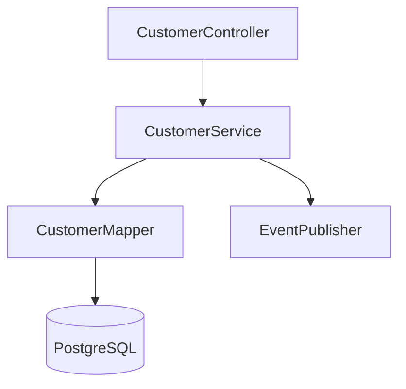
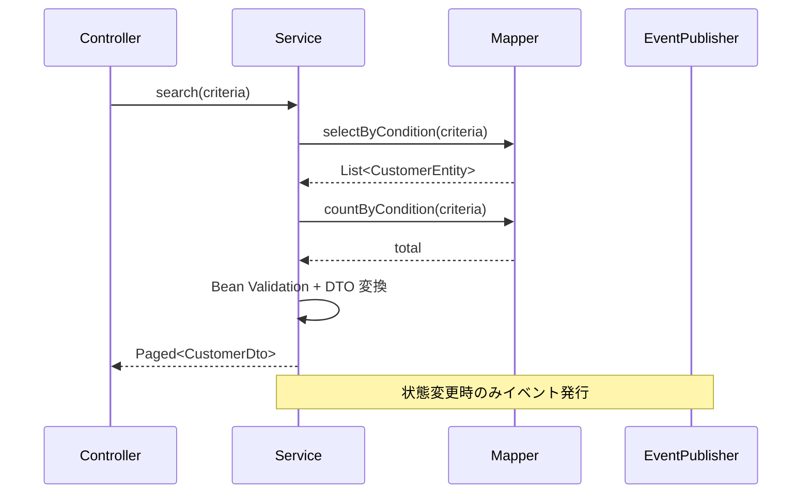

# 内部設計書 — [モジュール/コンポーネント名]

> ひな型: vue-biz-app-design-spec/docs/templates/template-internal-design.md
> **Backend モジュール (Spring) 向けの主軸ひな型**。
> Vue / Ionic フロントエンドのコンポーネント設計 (W5 / A6) は専用の `template-component-design.md` を優先する。本ひな型はフロントの汎用モジュール（共通処理層・SDK ラッパー等）にも適用可能。

## 0. 文書情報

| 項目        | 内容                                  |
| ----------- | ------------------------------------- |
| 文書 ID      | ID-[YYYY-NNN]                        |
| バージョン   | 0.1.0                                 |
| 作成日       | YYYY-MM-DD                            |
| 作成者       | [氏名]                                |
| 対象範囲     | [Backend モジュール / Web 画面群 / Android 画面群] |

---

## 1. 対象モジュール / コンポーネント

| 項目     | 内容                                                            |
| -------- | --------------------------------------------------------------- |
| 識別 ID   | MOD-[NNN]                                                       |
| 名称      | [モジュール名 / コンポーネント名]                               |
| 種別      | Spring @Service / Spring @RestController / Vue コンポーネント / Composable |
| 配置場所  | [src/main/java/.../customer/ または src/views/Customer/]        |

---

## 2. 責務

### 2.1 概要

[このモジュールが負う責務を 2-4 行で]

### 2.2 やること

- [責務1]
- [責務2]

### 2.3 やらないこと（責務外）

- [明示的な責務外項目1]
- [明示的な責務外項目2]

---

## 3. 公開インターフェース

### 3.1 関数/メソッド/コンポーネント

| 名前           | シグネチャ                                                     | 用途                            |
| -------------- | -------------------------------------------------------------- | ------------------------------- |
| `findById`     | `(id: CustomerId): Promise<Customer>` / `Customer findById(CustomerId id)` | 顧客 ID で 1 件取得              |
| `search`       | `(criteria: SearchCriteria): Promise<Paged<Customer>>` / `Page<Customer> search(SearchCriteria criteria)` | 条件検索（ページング付き）       |

### 3.2 型定義

TypeScript (Web/Android) 側:

```typescript
type CustomerId = string & { readonly __brand: 'CustomerId' };

interface SearchCriteria {
  code?: string;
  name?: string;
  status?: CustomerStatus;
  page: number;
  perPage: number;
}

interface Paged<T> {
  items: readonly T[];
  total: number;
  page: number;
  perPage: number;
}
```

Java (Backend) 側:

```java
public record CustomerId(String value) {}

public record SearchCriteria(
    @Nullable String code,
    @Nullable String name,
    @Nullable CustomerStatus status,
    @Min(1) int page,
    @Min(1) @Max(100) int perPage
) {}

public record Paged<T>(List<T> items, long total, int page, int perPage) {}
```

---

## 4. 依存関係

| 依存先          | 種別          | 用途                                |
| --------------- | ------------- | ----------------------------------- |
| `CustomerMapper` | MyBatis Mapper | DB アクセス                         |
| `Logger`        | 内部           | 構造化ログ出力                       |
| `EventPublisher` | 内部           | 顧客状態変更イベント発行             |

依存関係図 (Mermaid):



---

## 5. 内部処理フロー

主要処理のシーケンス図:



---

## 6. データ構造（内部状態）

[モジュールが保持する内部状態があれば記載。Stateless が原則]

| 状態名      | 型                          | 初期値        | 用途                              |
| ----------- | --------------------------- | ------------- | --------------------------------- |
| (なし)      |                             |               | サービスはステートレスとする       |

---

## 7. 例外処理

| 例外クラス                    | 発生条件                          | 処理                                          |
| ----------------------------- | --------------------------------- | --------------------------------------------- |
| `CustomerNotFoundException`   | 指定 ID の顧客なし                | 404 + errorCode `E-CUSTOMER-404` を返却        |
| `MethodArgumentNotValidException` | Bean Validation エラー            | 400 + RFC 7807 Problem Details を返却         |
| 想定外例外                    | -                                 | Logger.error + 500 + errorCode `E-SYS-500`    |

---

## 8. ログ出力

| イベント       | レベル | 構造化フィールド                                | 監査対象 |
| -------------- | ------ | ----------------------------------------------- | -------- |
| 検索実行       | INFO   | `userId`, `criteria`, `resultCount`             | -        |
| 詳細取得       | INFO   | `userId`, `customerId`                          | -        |
| 顧客状態更新   | INFO   | `userId`, `customerId`, `oldStatus`, `newStatus` | ◯       |

ログ規約は **B6 ログ・監査ログ設計書** に従う。

---

## 9. 性能考慮事項

| 項目              | 想定値                                  | 対応                                                  |
| ----------------- | --------------------------------------- | ----------------------------------------------------- |
| 検索 RPS           | 100 RPS                                 | MyBatis SQL にインデックス必須 (`code`, `status`)       |
| 一覧データボリューム | 1 ページあたり 50 件、総 100K 件          | サーバーサイドページング・キーセットページング検討     |
| 詳細取得レイテンシ  | p95 < 200ms                              | キャッシュ層導入（Redis）検討                          |

---

## 10. テスト方針

- 単体: `findById` / `search` / `update` の正常系・例外系
- 結合: TestContainers (PostgreSQL) + 実 MyBatis Mapper で repository 層含めて検証
- カバレッジ目標: ステートメント・ブランチとも 80% (DD-042)

詳細は **B8 / W7 / A8 テスト仕様書** を参照。

---

## 11. 関連ドキュメント

- 機能要件: F-[NNN]
- API 仕様: S3
- DB 設計: B2 (Backend のみ)
- テスト仕様: B8 / W7 / A8
