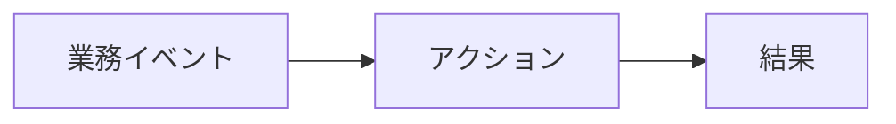

# 要件定義書 — [プロジェクト名]

> このファイルは [vue-biz-app-design-spec/docs/templates/template-requirements.md](https://github.com/m-miyawaki-m/vue-biz-app-design-spec) を起点としたひな型。
> プロジェクトに合わせて埋める。空欄や TBD のままレビュー提出してはいけない。

## 0. 文書情報

| 項目     | 内容                          |
| -------- | ----------------------------- |
| 文書 ID   | RD-[YYYY-NNN]                |
| バージョン | 0.1.0                         |
| 作成日    | YYYY-MM-DD                    |
| 作成者    | [氏名]                        |
| 承認者    | [氏名]                        |
| 適用範囲  | [Backend / Web / Android / 共通] |

### 更新履歴

| バージョン | 日付       | 更新者 | 変更内容 |
| ---------- | ---------- | ------ | -------- |
| 0.1.0      | YYYY-MM-DD | [氏名] | 初版     |

---

## 1. 目的と対象範囲

### 1.1 目的

本文書は [対象システム] の要件を定義する。読者: PM・アーキテクト・開発リード・QA リード・ステークホルダー。

### 1.2 対象範囲

- 含むもの: [機能領域 / 業務範囲]
- 含まないもの: [スコープ外を明示]

### 1.3 用語

業務用語の詳細は **データ辞書 (S2)** を参照。本文書では主要用語のみ要約する。

| 用語           | 定義                                                |
| -------------- | --------------------------------------------------- |
| [業務用語1]    | [定義]                                              |

---

## 2. 業務概要

### 2.1 業務全体像

業務フロー図（Mermaid）:

### 2.2 登場ロール

| ロール ID  | 名称            | 主要責務                                     |
| ---------- | --------------- | -------------------------------------------- |
| ROLE-001   | [担当者ロール]  | [責務]                                       |
| ROLE-002   | [管理者ロール]  | [責務]                                       |

---

## 3. ユースケース一覧

| UC ID    | 名称                    | 主アクター | 事前条件 | 事後条件 | 関連機能 ID  |
| -------- | ----------------------- | ---------- | -------- | -------- | ------------ |
| UC-001   | [ユースケース名]        | ROLE-001   | [条件]   | [結果]   | F-001, F-002 |

---

## 4. 機能要件

各機能は以下の章立てで記述する。

### F-NNN: [機能名]

| 項目        | 内容                                                          |
| ----------- | ------------------------------------------------------------- |
| 機能 ID      | F-NNN                                                         |
| 名称         | [機能名]                                                      |
| 概要         | [1-3 行で説明]                                                |
| 対象ロール   | ROLE-001, ROLE-002                                            |
| 関連 UC      | UC-NNN                                                        |
| 入力         | [入力データ・パラメータ。データ辞書 (S2) を参照]              |
| 処理         | [業務処理の流れ。業務ルールへのリンク]                        |
| 出力         | [出力データ・通知]                                            |
| 例外         | [異常系・業務エラー。エラーコード一覧 (S5) を参照]            |
| 優先度       | 必須 / 高 / 中 / 低                                           |
| 備考         | [補足]                                                        |

---

## 5. 業務ルール

| ルール ID | 名称                  | 内容                                              | 関連機能          |
| --------- | --------------------- | ------------------------------------------------- | ----------------- |
| BR-001    | [ルール名]            | [if ... then ... の論理規則]                      | F-001, F-002      |

---

## 6. 非機能要件

非機能要件の詳細は **非機能要件書 (S6)** を参照。本文書では本プロジェクト固有の追加要件のみ記載する。

| カテゴリ       | 要件                                              |
| -------------- | ------------------------------------------------- |
| 性能           | [API レスポンス 95%tile < 500ms 等]               |
| 可用性         | [99.9% 等]                                         |
| セキュリティ   | [認証/認可仕様書 (S4) に従う]                     |
| アクセシビリティ | [WCAG 2.1 AA 準拠等]                              |

---

## 7. 制約事項

| 制約 ID | 内容                                                            |
| ------- | --------------------------------------------------------------- |
| C-001   | [使用可能な OS / ブラウザ / 言語制約等]                          |
| C-002   | [既存システム連携の API バージョン制約等]                       |

---

## 8. 前提条件

- [前提条件 1: 例 / お客様側で X が稼働済みである]
- [前提条件 2]

---

## 9. 将来課題（本リリースでは見送り）

| 項目                    | 想定対応時期 |
| ----------------------- | ------------ |
| [機能 X の追加]         | 次フェーズ   |

---

## 10. 関連ドキュメント

- 業務要件定義書 (共有部分): S1
- データ辞書: S2
- API 仕様書: S3
- 認証/認可仕様書: S4
- 業務エラーコード一覧: S5
- 非機能要件書: S6
- 画面設計書: W3 / A3
- 内部設計書: B3 / W5 / A6
