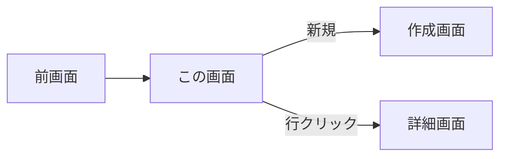
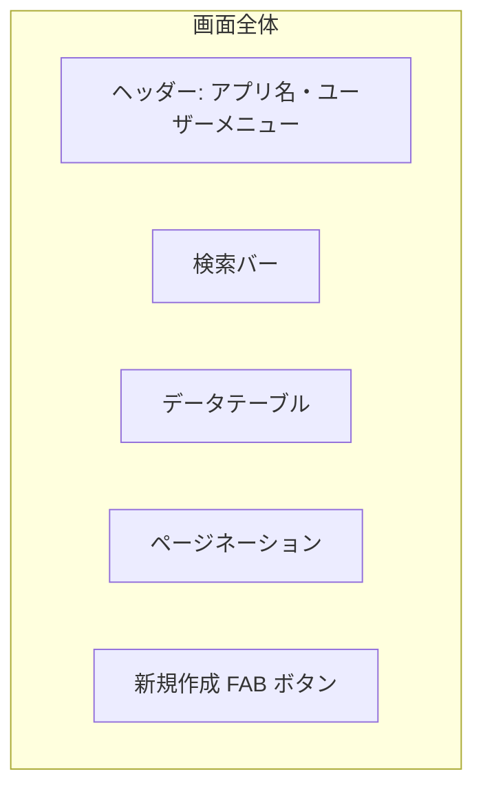
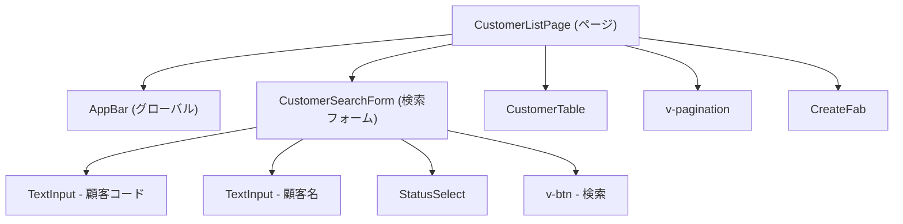
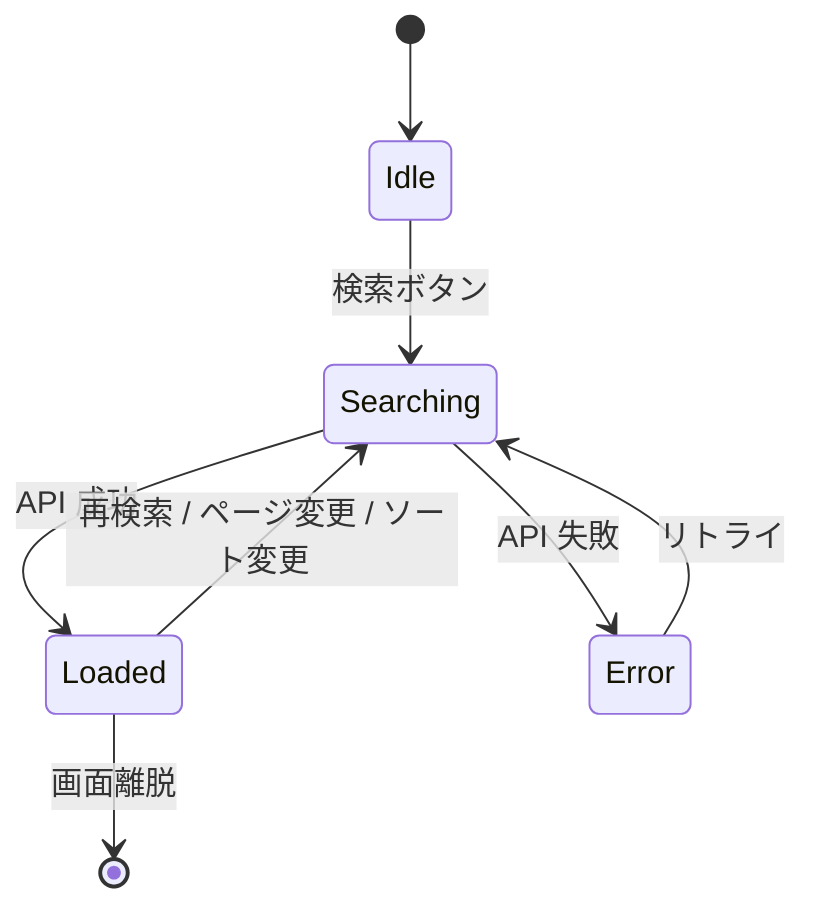

# 画面設計書 — [画面名]

> ひな型: vue-biz-app-design-spec/docs/templates/template-screen-design.md
> Web (Vuetify3) / Android (Ionic) のいずれにも適用可。コンポーネント割当の章で Vuetify / Ionic を選択する。
> 概要レベル（全画面一覧・遷移図）は別途 template-screen-list.md (W2/A2) で管理。

## 0. 文書情報

| 項目                  | 内容              |
| --------------------- | ----------------- |
| 文書 ID                | SD-[YYYY-NNN]    |
| バージョン             | 0.1.0             |
| 作成日                 | YYYY-MM-DD        |
| 作成者                 | [氏名]            |
| 対象プラットフォーム    | Web / Android     |

### 更新履歴

| バージョン | 日付       | 更新者 | 変更内容 |
| ---------- | ---------- | ------ | -------- |
| 0.1.0      | YYYY-MM-DD | [氏名] | 初版     |

---

## 1. 画面情報

| 項目        | 内容                              |
| ----------- | --------------------------------- |
| 画面 ID      | SCR-[NNN]                         |
| 画面名       | [日本語名]                        |
| 識別名       | [英語キャメル: customerListPage]  |
| URL          | /customers                       |
| 関連 UC      | UC-001, UC-002                    |
| 対象ロール   | ROLE-001                          |

---

## 2. 画面概要

### 2.1 利用シーン

[いつ、誰が、何のために使う画面か]

### 2.2 主要機能サマリ

- [機能1: 検索]
- [機能2: 一覧表示]
- [機能3: 新規作成導線]

---

## 3. 画面遷移



| 遷移元 → 先 | トリガー | 条件 |
| ----------- | -------- | ---- |
| ログイン画面 → この画面 | ログイン成功 | 認証成功 + ロール=ROLE-001 |
| この画面 → 詳細画面 | 行クリック | — |

---

## 4. レイアウト

ワイヤーフレーム (画像 or Mermaid):



レイアウトの方針:

- 検索バー（上部固定）→ テーブル（メイン）→ ページネーション（下部）
- FAB は右下固定（モバイル時）/ 検索バー横に「新規」ボタン（Web 時）

---

## 5. コンポーネントツリー

画面を構成する Vue / Ionic コンポーネントの親子関係。



### 5.1 コンポーネント定義表

| コンポーネント        | 種別           | 提供元              | 主な Props                                        | 主な Emits                       | 配置                              |
| --------------------- | -------------- | ------------------- | ------------------------------------------------- | -------------------------------- | --------------------------------- |
| CustomerListPage      | ページ          | 案件内              | -（router.params から取得）                       | -                                | `src/views/customer/CustomerListPage.vue` |
| AppBar                | 共通レイアウト   | 案件内 (shared)     | `userName: string`, `role: Role`                  | `logout`                         | `src/layouts/AppBar.vue`          |
| CustomerSearchForm    | 部分            | 案件内              | `modelValue: SearchCriteria`                       | `update:modelValue`, `submit`     | `src/components/customer/CustomerSearchForm.vue` |
| TextInput             | 原子部品 (wrap) | 案件内 (shared)     | `modelValue`, `label`, `rules?`, `error?`         | `update:modelValue`              | `src/components/atoms/TextInput.vue` |
| StatusSelect          | 原子部品         | 案件内              | `modelValue`, `options: StatusOption[]`           | `update:modelValue`              | `src/components/customer/StatusSelect.vue` |
| CustomerTable         | 部分            | 案件内              | `items: Customer[]`, `loading: boolean`, `sortBy?` | `rowClick (id)`, `sort (column)`  | `src/components/customer/CustomerTable.vue` |
| v-pagination          | 原子部品 (lib)  | Vuetify             | `modelValue`, `length`, `totalVisible`            | `update:modelValue`              | -                                 |
| CreateFab             | 共通             | 案件内 (shared)     | `disabled?: boolean`                              | `click`                          | `src/components/shared/CreateFab.vue` |

### 5.2 Slots / 公開構造（複雑な場合のみ）

```typescript
// CustomerTable.vue のスロット定義例
defineSlots<{
  'item.status': (props: { item: Customer }) => any;  // 状態列のカスタム描画
  'no-data': () => any;                                // データなし時のカスタム表示
}>();
```

---

## 6. 項目定義

| 項目 ID  | 名称       | 種別         | 型・桁         | 必須 | 初期値 | バリデーション                                       | コンポーネント        | 備考             |
| -------- | ---------- | ------------ | -------------- | ---- | ------ | ---------------------------------------------------- | --------------------- | ---------------- |
| F-001    | 顧客コード | 検索入力     | string(20)     | -    | -      | 半角英数のみ                                         | v-text-field          | データ辞書: CUSTOMER_CODE |
| F-002    | 顧客名     | 検索入力     | string(100)    | -    | -      | -                                                    | v-text-field          | 部分一致         |
| F-003    | 状態       | 検索プルダウン | enum           | -    | 全て   | -                                                    | v-select              | コード値: S2 参照 |
| F-004    | 検索ボタン | アクション   | -              | -    | -      | -                                                    | v-btn                 | F-005 を実行     |
| F-005    | 検索結果   | テーブル     | 顧客情報の配列 | -    | -      | -                                                    | v-data-table-server   | サーバーサイドページング |

### 6.1 テーブル列定義（F-005）

| 列 ID    | 列名       | 型       | ソート | フィルタ | アクション   |
| -------- | ---------- | -------- | ------ | -------- | ------------ |
| C-001    | 顧客コード | string   | ◯     | -        | クリックで詳細遷移 |
| C-002    | 顧客名     | string   | ◯     | -        | -            |
| C-003    | 状態       | enum     | ◯     | ◯       | バッジ表示   |
| C-004    | 更新日時   | datetime | ◯     | -        | YYYY/MM/DD HH:mm |

---

## 7. アクション一覧

| アクション ID | トリガー               | 処理                                         | 呼び出し API             |
| ------------- | ---------------------- | -------------------------------------------- | ------------------------ |
| A-001         | 検索ボタンクリック     | F-001〜F-003 で API 呼出、F-005 を更新       | GET /v1/customers?...    |
| A-002         | ページネーション変更   | API 呼出（page/perPage を変えて）            | GET /v1/customers?...    |
| A-003         | FAB クリック           | 新規作成画面へ遷移                            | -                        |
| A-004         | 行クリック             | 詳細画面へ遷移（顧客 ID をパラメータ）        | -                        |

---

## 8. 状態管理 / 値のソースマップ

### 8.1 ソースマップ（各表示値の出どころ）

画面に表示・参照される全ての値について、ソース種別と具体的な取得経路を明示する。

| 値 / 表示項目             | 表示位置          | ソース種別                  | 具体的なストア / API / ストレージ              | 備考                                      |
| ------------------------- | ----------------- | --------------------------- | ---------------------------------------------- | ----------------------------------------- |
| ユーザー名                | AppBar 右上       | Pinia                       | `useAuthStore().user.name`                     | JWT デコードから初期化                     |
| ロール                    | (条件分岐用)       | Pinia                       | `useAuthStore().user.role`                     | JWT claim                                 |
| 検索条件 (code/name/status) | 検索フォーム      | Pinia (フォーム下書き)      | `useCustomerSearchStore().criteria`            | URL クエリと双方向同期                     |
| 検索結果一覧              | テーブル          | TanStack Query              | `useCustomersQuery(criteria)` → GET /v1/customers | キャッシュキー: `['customers', criteria]`  |
| ローディング状態          | テーブル / FAB    | TanStack Query              | `useCustomersQuery().isFetching`               | -                                         |
| エラー状態                | スナックバー       | TanStack Query              | `useCustomersQuery().error`                    | RFC 7807 を Snackbar 用にマップ            |
| ページ番号                | ページネーション   | URL クエリ                  | `route.query.page` ↔ Pinia 経由                | F5 で復元可能                             |
| 選択中ソート              | テーブル列見出し  | URL クエリ                  | `route.query.sortBy`                            | F5 で復元可能                             |
| FAB の活性/非活性        | FAB              | computed                    | `useAuthStore().hasRole('ROLE-002')`            | 権限により非表示                          |
| 状態バッジの色           | テーブル C-003 列  | computed                    | `(status) => statusColorMap[status]`            | コード値マップ参照                         |

### 8.2 ソース種別の凡例

| 種別                    | 用途                                              | 例                                       |
| ----------------------- | ------------------------------------------------- | ---------------------------------------- |
| Pinia                   | UI 状態・認証情報・フォーム下書き                  | `useAuthStore`, `useFormDraftStore`      |
| TanStack Query           | サーバー由来データ（キャッシュ・再取得・楽観更新） | `useCustomersQuery`                      |
| URL クエリ / params      | URL 復元可能な状態（ページング・検索条件）         | `route.query.page`, `route.params.id`    |
| props                   | 親コンポーネントから渡される                       | `defineProps<{ items: Customer[] }>()`   |
| local ref / reactive     | コンポーネント内部の一時状態                       | `const isOpen = ref(false)`              |
| computed                | 他の値からの派生                                  | `const canEdit = computed(() => ...)`    |
| JWT claim               | ユーザー情報・権限（authStore 経由で参照）         | `useAuthStore().user.role`               |
| LocalStorage            | 永続化したいユーザー設定（テーマ等）               | `useLocalStorage('theme', 'light')`      |
| Capacitor Preferences    | Android 永続化 (Secure Storage 経由)              | `await Preferences.get({ key: ... })`     |
| ENV (Vite)              | ビルド時定数 (`VITE_*`)                            | `import.meta.env.VITE_API_BASE_URL`      |

### 8.3 状態遷移図（複雑な画面のみ）



---

## 9. API 連携

| API ID         | エンドポイント            | 用途                  | 関連画面項目  |
| -------------- | ------------------------- | --------------------- | ------------- |
| API-CUST-001   | GET /v1/customers          | 一覧取得・検索        | F-005         |

API スキーマ詳細は **S3 API 仕様書** を参照。
内部処理詳細は **B5 API 内部処理設計書** (`template-api-internal.md`) を参照。

---

## 10. エラー処理

| エラー種別     | 画面表示                                                | 関連エラーコード      |
| -------------- | ------------------------------------------------------- | --------------------- |
| 認証切れ (401) | ログイン画面へ自動遷移                                  | E-AUTH-002            |
| 権限不足 (403) | エラーメッセージ表示 + 前画面へ戻る                       | E-AUTH-003            |
| サーバーエラー (5xx) | スナックバー表示「サーバーエラーが発生しました」+ リトライ | E-SYS-001             |
| バリデーションエラー (400) | 該当項目にエラーメッセージ表示                    | E-CUSTOMER-*          |

業務エラーコードは **S5 業務エラーコード一覧** を参照。

---

## 11. アクセシビリティ・キーボード操作

| 操作                   | キー                       |
| ---------------------- | -------------------------- |
| 検索実行               | Enter                      |
| 検索条件クリア          | Escape                     |
| 行間移動                | ↑ / ↓                      |
| 新規作成画面へ          | Alt + N                    |

ARIA 属性:

- `v-data-table` の各セルに `role="cell"` + 列見出しと関連付け
- ローディング中は `aria-busy="true"`

---

## 12. レスポンシブ対応 (Web のみ)

| 画面幅                    | レイアウト変化                                |
| ------------------------- | --------------------------------------------- |
| ≥ 1280px (デスクトップ)    | サイドバー表示・テーブル全列表示              |
| 960-1279px (タブレット)    | サイドバー折りたたみ・テーブル列省略可        |
| < 960px (モバイル/簡易閲覧) | カードリスト表示に切替                         |

---

## 13. Android 固有 (該当時)

| 項目                   | 内容                                              |
| ---------------------- | ------------------------------------------------- |
| Ionic ナビ構造          | Tab 配下のスタック [Tab=顧客] / [Stack=一覧→詳細] |
| プルダウンリフレッシュ   | あり (`ion-refresher`)                            |
| 無限スクロール          | あり (`ion-infinite-scroll`)                      |
| ハードウェアバック       | スタックポップで前画面復帰                         |

---

## 14. 補足事項

- [補足や検討中の事項を残す]

---

## 15. 関連ドキュメント

- W2 / A2 画面一覧・画面遷移図 (template-screen-list.md)
- W4 状態管理・データフロー設計書
- W5 / A6 コンポーネント設計書 (template-internal-design.md)
- S3 API 仕様書
- S5 業務エラーコード一覧
