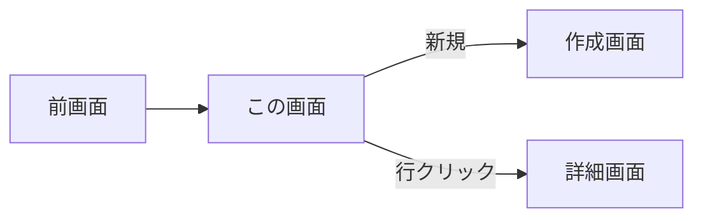
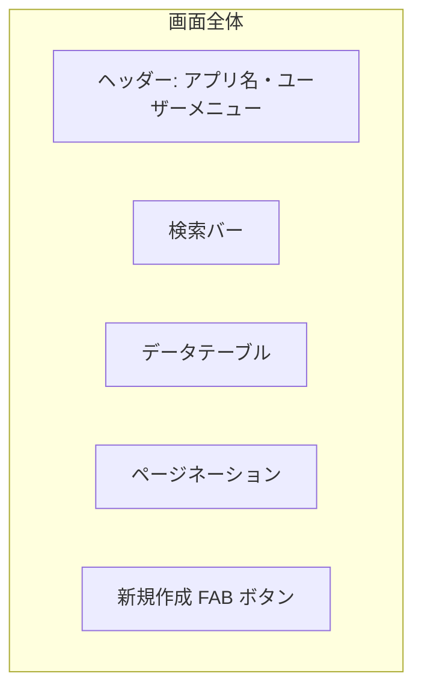

# 画面設計書 — [画面名]

> ひな型: vue-biz-app-design-spec/docs/templates/template-screen-design.md
> Web (Vuetify3) / Android (Ionic) のいずれにも適用可。コンポーネント割当の章で Vuetify / Ionic を選択する。

## 0. 文書情報

| 項目         | 内容                            |
| ------------ | ------------------------------- |
| 文書 ID       | SD-[YYYY-NNN]                  |
| バージョン    | 0.1.0                           |
| 作成日        | YYYY-MM-DD                      |
| 作成者        | [氏名]                          |
| 対象プラットフォーム | Web / Android                   |

### 更新履歴

| バージョン | 日付       | 更新者 | 変更内容 |
| ---------- | ---------- | ------ | -------- |
| 0.1.0      | YYYY-MM-DD | [氏名] | 初版     |

---

## 1. 画面情報

| 項目        | 内容                              |
| ----------- | --------------------------------- |
| 画面 ID      | SCR-[NNN]                         |
| 画面名       | [日本語名]                        |
| 識別名       | [英語キャメル: customerListPage]  |
| URL          | /customers                       |
| 関連 UC      | UC-001, UC-002                    |
| 対象ロール   | ROLE-001                          |

---

## 2. 画面概要

### 2.1 利用シーン

[いつ、誰が、何のために使う画面か]

### 2.2 主要機能サマリ

- [機能1: 検索]
- [機能2: 一覧表示]
- [機能3: 新規作成導線]

---

## 3. 画面遷移

| 遷移元 → 先 | トリガー | 条件 |
| ----------- | -------- | ---- |
| ログイン画面 → この画面 | ログイン成功 | 認証成功 + ロール=ROLE-001 |
| この画面 → 詳細画面 | 行クリック | — |

---

## 4. レイアウト

ワイヤーフレーム (画像 or Mermaid):

レイアウトの方針:

- 検索バー（上部固定）→ テーブル（メイン）→ ページネーション（下部）
- FAB は右下固定（モバイル時）/ 検索バー横に「新規」ボタン（Web 時）

---

## 5. 項目定義

| 項目 ID  | 名称       | 種別         | 型・桁         | 必須 | 初期値 | バリデーション                                       | コンポーネント        | 備考             |
| -------- | ---------- | ------------ | -------------- | ---- | ------ | ---------------------------------------------------- | --------------------- | ---------------- |
| F-001    | 顧客コード | 検索入力     | string(20)     | -    | -      | 半角英数のみ                                         | v-text-field          | データ辞書: CUSTOMER_CODE |
| F-002    | 顧客名     | 検索入力     | string(100)    | -    | -      | -                                                    | v-text-field          | 部分一致         |
| F-003    | 状態       | 検索プルダウン | enum           | -    | 全て   | -                                                    | v-select              | コード値: S2 参照 |
| F-004    | 検索ボタン | アクション   | -              | -    | -      | -                                                    | v-btn                 | F-005 を実行     |
| F-005    | 検索結果   | テーブル     | 顧客情報の配列 | -    | -      | -                                                    | v-data-table-server   | サーバーサイドページング |

### 5.1 テーブル列定義（F-005）

| 列 ID    | 列名       | 型       | ソート | フィルタ | アクション   |
| -------- | ---------- | -------- | ------ | -------- | ------------ |
| C-001    | 顧客コード | string   | ◯     | -        | クリックで詳細遷移 |
| C-002    | 顧客名     | string   | ◯     | -        | -            |
| C-003    | 状態       | enum     | ◯     | ◯       | バッジ表示   |
| C-004    | 更新日時   | datetime | ◯     | -        | YYYY/MM/DD HH:mm |

---

## 6. アクション一覧

| アクション ID | トリガー               | 処理                                         | 呼び出し API             |
| ------------- | ---------------------- | -------------------------------------------- | ------------------------ |
| A-001         | 検索ボタンクリック     | F-001〜F-003 で API 呼出、F-005 を更新       | GET /v1/customers?...    |
| A-002         | ページネーション変更   | API 呼出（page/perPage を変えて）            | GET /v1/customers?...    |
| A-003         | FAB クリック           | 新規作成画面へ遷移                            | -                        |
| A-004         | 行クリック             | 詳細画面へ遷移（顧客 ID をパラメータ）        | -                        |

---

## 7. 状態管理

| 状態 ID    | 名称              | 種別               | 管理場所            |
| ---------- | ----------------- | ------------------ | ------------------- |
| ST-001     | 検索条件          | フォーム下書き     | Pinia               |
| ST-002     | 検索結果一覧      | サーバーキャッシュ | TanStack Query      |
| ST-003     | ローディング状態   | サーバー状態        | TanStack Query (isFetching) |
| ST-004     | エラー状態         | サーバー状態        | TanStack Query (error)      |

---

## 8. API 連携

| API ID         | エンドポイント            | 用途                  | 関連画面項目  |
| -------------- | ------------------------- | --------------------- | ------------- |
| API-CUST-001   | GET /v1/customers          | 一覧取得・検索        | F-005         |

API スキーマ詳細は **S3 API 仕様書** を参照。

---

## 9. エラー処理

| エラー種別     | 画面表示                                                | 関連エラーコード      |
| -------------- | ------------------------------------------------------- | --------------------- |
| 認証切れ (401) | ログイン画面へ自動遷移                                  | E-AUTH-002            |
| 権限不足 (403) | エラーメッセージ表示 + 前画面へ戻る                       | E-AUTH-003            |
| サーバーエラー (5xx) | スナックバー表示「サーバーエラーが発生しました」+ リトライ | E-SYS-001             |
| バリデーションエラー (400) | 該当項目にエラーメッセージ表示                    | E-CUSTOMER-*          |

業務エラーコードは **S5 業務エラーコード一覧** を参照。

---

## 10. アクセシビリティ・キーボード操作

| 操作                   | キー                       |
| ---------------------- | -------------------------- |
| 検索実行               | Enter                      |
| 検索条件クリア          | Escape                     |
| 行間移動                | ↑ / ↓                      |
| 新規作成画面へ          | Alt + N                    |

ARIA 属性:

- `v-data-table` の各セルに `role="cell"` + 列見出しと関連付け
- ローディング中は `aria-busy="true"`

---

## 11. レスポンシブ対応 (Web のみ)

| 画面幅                    | レイアウト変化                                |
| ------------------------- | --------------------------------------------- |
| ≥ 1280px (デスクトップ)    | サイドバー表示・テーブル全列表示              |
| 960-1279px (タブレット)    | サイドバー折りたたみ・テーブル列省略可        |
| < 960px (モバイル/簡易閲覧) | カードリスト表示に切替                         |

---

## 12. Android 固有 (該当時)

| 項目                   | 内容                                              |
| ---------------------- | ------------------------------------------------- |
| Ionic ナビ構造          | Tab 配下のスタック [Tab=顧客] / [Stack=一覧→詳細] |
| プルダウンリフレッシュ   | あり (`ion-refresher`)                            |
| 無限スクロール          | あり (`ion-infinite-scroll`)                      |
| ハードウェアバック       | スタックポップで前画面復帰                         |

---

## 13. 補足事項

- [補足や検討中の事項を残す]

---

## 14. 関連ドキュメント

- W2 画面一覧・画面遷移図
- W4 状態管理設計書
- W5 コンポーネント設計書
- S3 API 仕様書
- S5 業務エラーコード一覧
