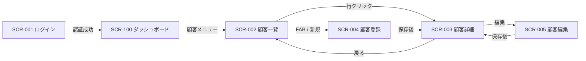
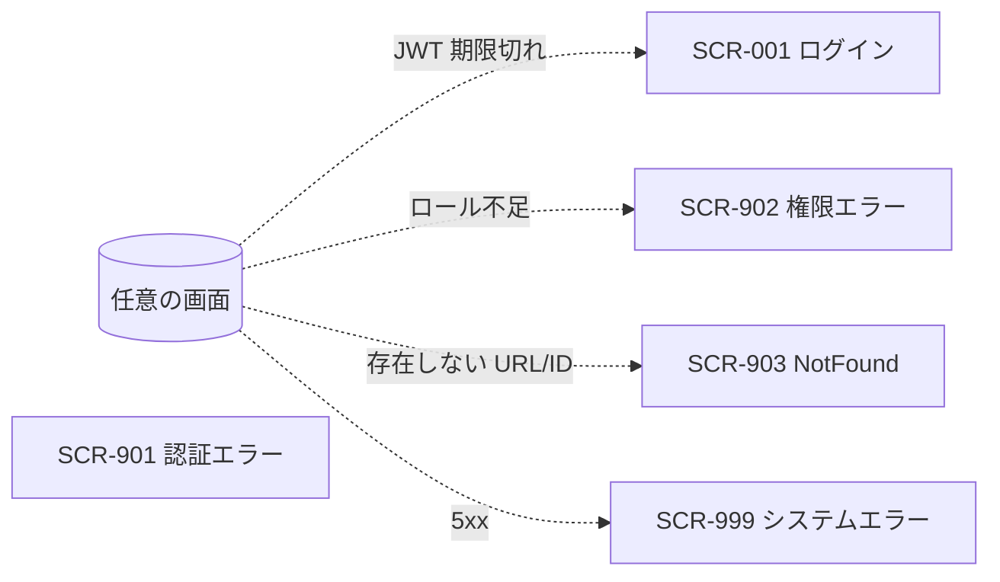
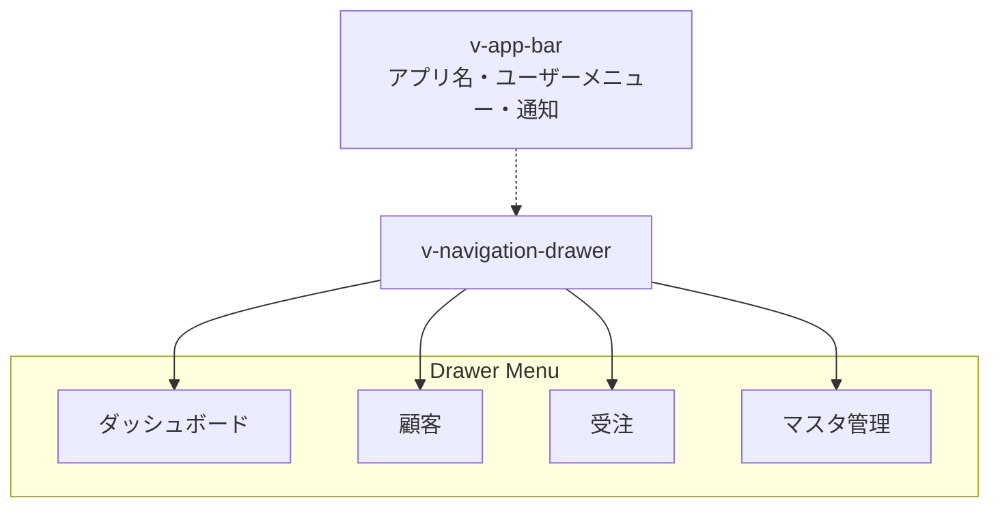
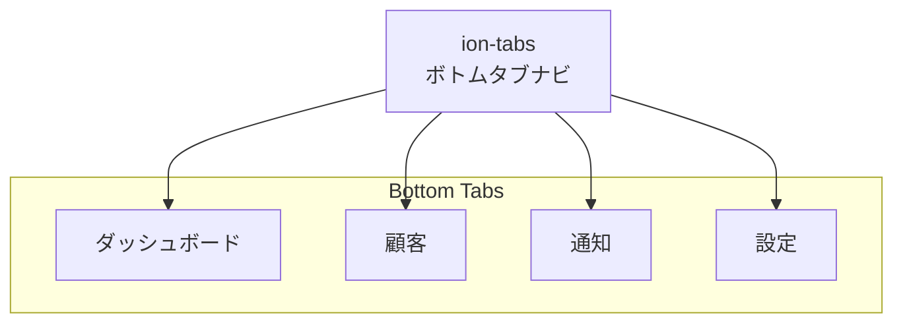

# 画面一覧・画面遷移図 — [プロジェクト名]

> ひな型: vue-biz-app-design-spec/docs/templates/template-screen-list.md
> Phase 2（基本設計）早期に書く「概要レベル」ドキュメント。
> 各画面の詳細は別途 template-screen-design.md で書く（W3/A3）。

## 0. 文書情報

| 項目                  | 内容              |
| --------------------- | ----------------- |
| 文書 ID                | SL-[YYYY-NNN]    |
| バージョン             | 0.1.0             |
| 作成日                 | YYYY-MM-DD        |
| 作成者                 | [氏名]            |
| 対象プラットフォーム    | Web / Android     |

### 更新履歴

| バージョン | 日付       | 更新者 | 変更内容 |
| ---------- | ---------- | ------ | -------- |
| 0.1.0      | YYYY-MM-DD | [氏名] | 初版     |

---

## 1. 画面一覧

| 画面 ID  | 画面名     | URL / Route      | 種別         | 対象ロール       | 関連 UC | 詳細リンク                                       |
| -------- | ---------- | ---------------- | ------------ | ---------------- | ------- | ------------------------------------------------ |
| SCR-001  | ログイン   | /login           | エントリ      | 全              | UC-001  | [W3 ログイン画面](screen-login.md)               |
| SCR-100  | ダッシュボード | /                | ダッシュボード | ROLE-001/002    | UC-005  | [W3 ダッシュボード](screen-dashboard.md)         |
| SCR-002  | 顧客一覧   | /customers       | リスト        | ROLE-001/002    | UC-010  | [W3 顧客一覧画面](screen-customer-list.md)       |
| SCR-003  | 顧客詳細   | /customers/:id   | 詳細          | ROLE-001/002    | UC-011  | [W3 顧客詳細画面](screen-customer-detail.md)     |
| SCR-004  | 顧客登録   | /customers/new   | 作成          | ROLE-002        | UC-012  | [W3 顧客登録画面](screen-customer-create.md)     |
| SCR-005  | 顧客編集   | /customers/:id/edit | 編集       | ROLE-002        | UC-013  | [W3 顧客編集画面](screen-customer-edit.md)       |
| SCR-901  | 認証エラー  | /errors/401      | エラー        | 全              | -       | (共通)                                           |
| SCR-902  | 権限エラー  | /errors/403      | エラー        | 全              | -       | (共通)                                           |
| SCR-903  | Not Found  | /errors/404      | エラー        | 全              | -       | (共通)                                           |
| SCR-999  | システムエラー | /errors/500    | エラー        | 全              | -       | (共通)                                           |

### 画面種別の定義

| 種別         | 説明                                                      |
| ------------ | --------------------------------------------------------- |
| エントリ      | 認証前の入口 (ログイン、パスワードリセット等)              |
| ダッシュボード | 認証後トップ、メトリクス・通知サマリ                       |
| リスト        | 検索 + 一覧表示                                            |
| 詳細          | 1 件の参照 + 関連リンク                                    |
| 作成          | 新規入力フォーム                                           |
| 編集          | 既存編集フォーム                                           |
| 確認          | 削除確認、送信確認                                         |
| エラー        | 401, 403, 404, 5xx 等                                      |

### 連番採番ルール

- `SCR-001`〜`SCR-099`: エントリ・認証関連
- `SCR-100`〜`SCR-199`: ダッシュボード・トップ
- `SCR-200`〜`SCR-899`: 業務領域（領域ごとに 100 番台で区切る、例: 顧客 200 番台、受注 300 番台...）
- `SCR-900`〜`SCR-999`: 共通エラー・システム画面

---

## 2. 画面遷移図

### 2.1 通常フロー

### 2.2 例外遷移

---

## 3. ロール × 画面マトリクス

縦軸=ロール、横軸=画面。`◯ 可 / × 不可 / △ 条件付き` を記入。

| ロール ＼ 画面            | SCR-001 ログイン | SCR-100 ダッシュ | SCR-002 顧客一覧 | SCR-003 顧客詳細 | SCR-004 顧客登録 | SCR-005 顧客編集 |
| ------------------------- | ---------------- | ---------------- | ----------------- | ----------------- | ----------------- | ----------------- |
| ROLE-001 (担当者)         | ◯               | ◯               | ◯ (担当範囲のみ)  | ◯ (担当範囲のみ)  | ×                | △ (担当範囲のみ)  |
| ROLE-002 (管理者)         | ◯               | ◯               | ◯                | ◯                | ◯                | ◯                |
| 未認証                    | ◯               | ×               | ×                | ×                | ×                | ×                |

権限チェックの実装は **S4 認証/認可仕様書** に従う。

---

## 4. ナビゲーション構造

### 4.1 Web (Vuetify)

| ナビ要素        | 種別                | 表示条件                              |
| --------------- | ------------------- | ------------------------------------- |
| AppBar          | グローバル          | 認証後の全画面                          |
| Drawer          | サイドナビ          | デスクトップ常時表示・タブレット折りたたみ |
| マスタ管理リンク | Drawer 内項目        | ROLE-002 のみ表示                       |

### 4.2 Android (Ionic)

各タブ配下に `ion-router-outlet` を持ち、スタックナビゲーションが独立する。ハードウェアバックボタンでスタック内 pop。

---

## 5. URL ルーティング規約

| 種別               | 規約                                                                | 例                                   |
| ------------------ | ------------------------------------------------------------------- | ------------------------------------ |
| パス命名            | 英小文字 + ハイフン区切り、リソース名は複数形                         | `/customers`, `/order-items`         |
| 詳細パス            | `/<resource>/:id`                                                   | `/customers/01HXXX...`               |
| アクションパス      | `/<resource>/:id/<action>`                                          | `/customers/01HXXX.../edit`          |
| クエリパラメータ    | 検索条件・ページング・ソート（URL 共有・F5 復元可能にする）           | `?status=active&page=1&sortBy=updatedAt:desc` |
| `:id` の型          | ULID / UUID（連番 ID は URL 露出しない）                              | `01HXXX...`                          |
| フラグメント        | 使わない（タブ切替もクエリパラメータで `?tab=...`）                  | -                                    |

ルーター実装: Web は Vue Router 4 (history mode)、Android は Vue Router 4 + Ionic 統合 (`IonRouterOutlet`)。

---

## 6. モーダル・ダイアログ一覧

画面遷移ではなくモーダル/ダイアログで開くものは別管理。

| モーダル ID | 名称           | トリガー元画面 | 種別                    |
| ----------- | -------------- | -------------- | ----------------------- |
| MDL-001     | 削除確認        | SCR-003        | 確認ダイアログ           |
| MDL-002     | パスワード変更   | (グローバル)   | フォームダイアログ        |

---

## 7. 補足事項

- [モバイル特有の補助画面（プル更新中、オフライン表示等）はこの一覧に含めない方針。状態は画面内で表現]
- [トースト・スナックバーは画面ではなく通知扱い]
- [印刷プレビュー画面が必要な場合は SCR-NNN-print のサブ ID を採番]

---

## 8. 関連ドキュメント

- 各画面詳細: W3 画面設計書 (template-screen-design.md)
- ユースケース一覧: B1/W1/A1 機能要件定義書
- ロール定義: S1 業務要件定義書 / S4 認証/認可仕様書
- API 仕様: S3
